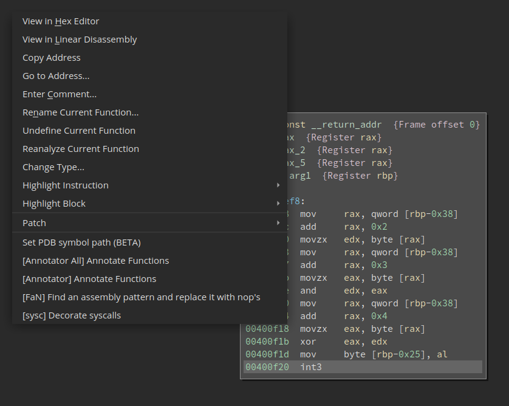
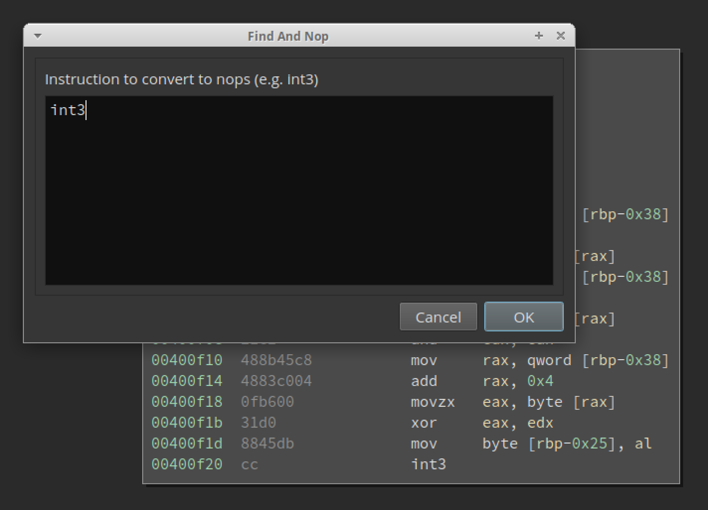
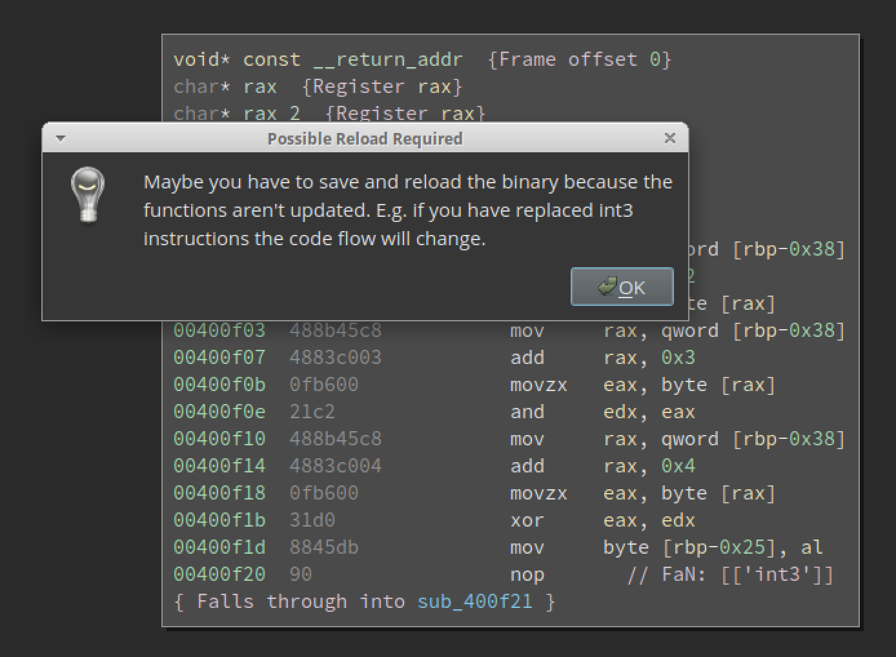
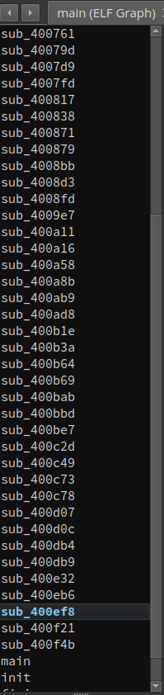
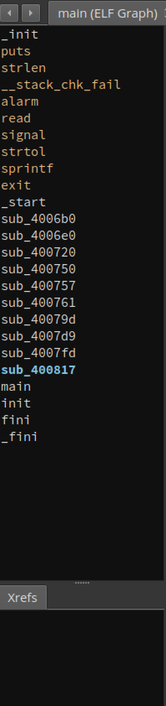
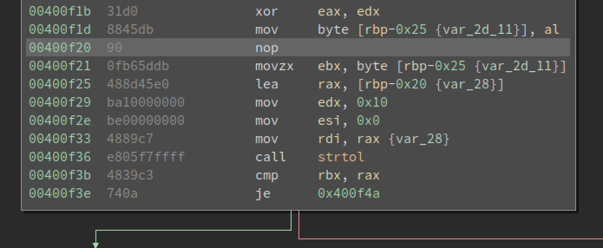

# Find and Nop
This plugin provides a simple feature to replace assembly patterns with nop's in the whole binary. This can be useful to defeat simple anti debugging features like breakpoints (int3 instructions) or anti vm mechanism which have the same pattern in the given binary.

## Installation
Just copy ```Find and Nop``` folder to your local binary ninja plugin folder.

## Usage
You can trigger the plugin via the right click context menu of binary ninja.

<br>

If you select the plugin, a prompt with a multi line text field appears where you can enter assembly code.<br>
For example:
```
int 3
```
or
```
mov rsi, rax
pop rsi
pop rdi
call strtol
```

<br>

<br>

After replacing the breakpoints of this sample we can compare the function list of the old and new binary.<br>

### Original
<br>

### Modified
<br><br>
Here you can see the replaced int3 instruction in the modified binary:

<br>
